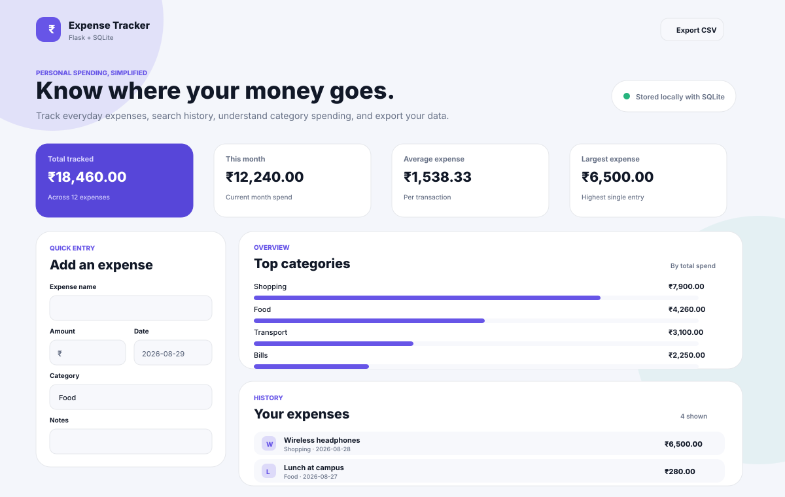
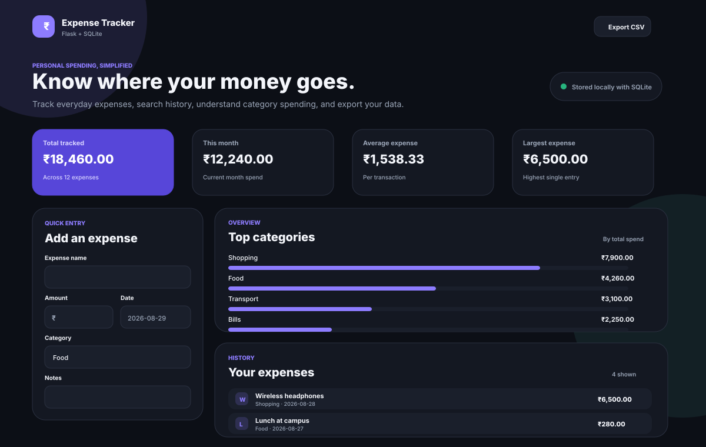

<div align="center">

# 💸 Expense Tracker

### A polished Flask + SQLite expense dashboard for everyday spending

Track expenses, understand where your money goes, search and filter your history, edit entries, and export everything to CSV — all in a lightweight local-first web app.


</div>

---

## ✨ What it does

Expense Tracker is a full CRUD web app built with Flask and SQLite. It started as one of my first-year backend projects and has since been upgraded into a cleaner, more complete portfolio project while keeping the original Flask fundamentals at its core.

### Highlights

- ➕ Add expenses with amount, category, date, and notes
- ✏️ Edit existing entries in a focused modal flow
- 🗑️ Delete expenses with confirmation
- 🔎 Search expenses and notes
- 🧩 Filter by category and sort by date or amount
- 📊 See total spend, monthly spend, average expense, and largest expense
- 📈 Visual category breakdown without a charting dependency
- 📁 Export the complete expense history as CSV
- 🌗 Light and dark themes with saved preference
- 📱 Fully responsive dashboard for desktop, tablet, and mobile
- 💾 Local-first SQLite storage
- ♿ Keyboard-friendly controls and reduced-motion support

---

## 📸 Interface previews

### Light theme



### Dark theme



---

## 🛠️ Tech stack

| Layer | Technology |
| --- | --- |
| Backend | Python, Flask |
| Database | SQLite |
| Templates | Jinja2, HTML5 |
| Styling | CSS3 |
| Interactions | Vanilla JavaScript |
| Production server | Gunicorn |

No frontend framework or heavy UI library is required.

---

## 🧱 Project structure

```text
.
├── app.py
├── requirements.txt
├── Procfile
├── .env.example
├── static/
│   ├── app.css
│   └── app.js
├── templates/
│   └── index.html
├── docs/
│   └── screenshots/
│       ├── dashboard-light.svg
│       └── dashboard-dark.svg
└── instance/
    └── expenses.db      # created automatically, gitignored
```

---

## 🚀 Run locally

### 1. Clone the repository

```bash
git clone https://github.com/Rishikeshsanin/Flask-py.git
cd Flask-py
```

### 2. Create a virtual environment

**Windows**

```powershell
py -m venv .venv
.venv\Scripts\activate
```

**macOS / Linux**

```bash
python3 -m venv .venv
source .venv/bin/activate
```

### 3. Install dependencies

```bash
pip install -r requirements.txt
```

### 4. Start the app

```bash
python app.py
```

Open `http://127.0.0.1:5000` in your browser.

---

## ⚙️ Configuration

The app works with zero configuration for local development. Optional environment variables are documented in `.env.example`.

| Variable | Purpose |
| --- | --- |
| `SECRET_KEY` | Flask session / flash-message secret |
| `DATABASE_PATH` | Override the default SQLite database path |
| `FLASK_DEBUG=1` | Enable Flask debug mode locally |

> For a hosted production deployment, use a persistent disk or a managed database if the platform's filesystem is ephemeral.

---

## 🧠 What I learned

This project began as a first-year exercise in connecting a Python backend to a database. The original version taught me the fundamentals of:

- Flask routes and request handling
- CRUD operations
- SQL and SQLite persistence
- Jinja2 templating
- HTML forms and backend validation

The glow-up added stronger input validation, backward-compatible database migration, search/filter/sort logic, export handling, responsive UI architecture, accessible interactions, and a more production-minded project structure.

---

## 🗺️ Possible next steps

- User accounts and authentication
- Recurring expenses
- Budgets and category limits
- Monthly trend charts
- Import from CSV
- PostgreSQL for persistent cloud deployment
- Automated backend tests and CI

---

## 📄 License

Released under the [MIT License](LICENSE).

---

<div align="center">

Built as a learning project, upgraded with care, and kept intentionally lightweight.

</div>
